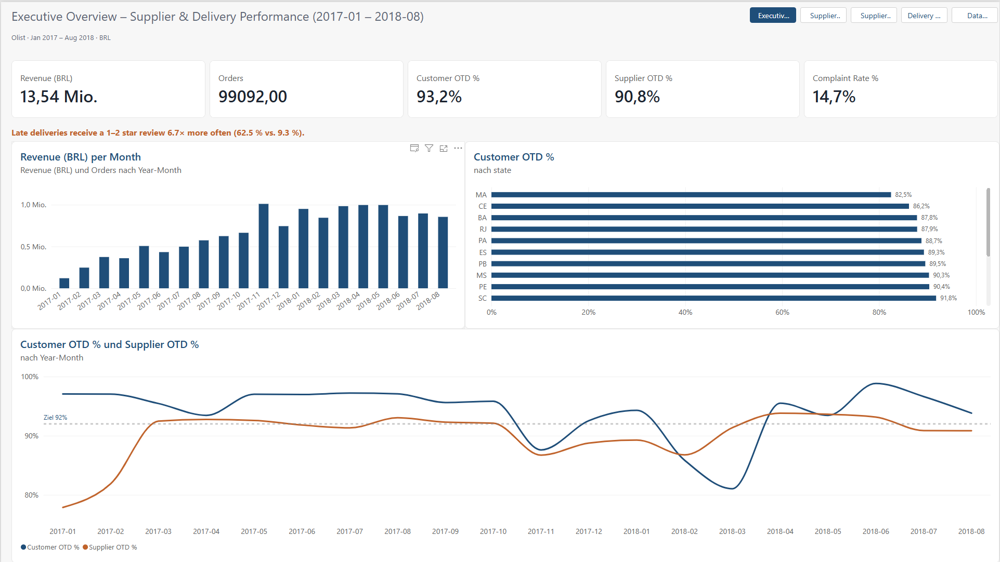
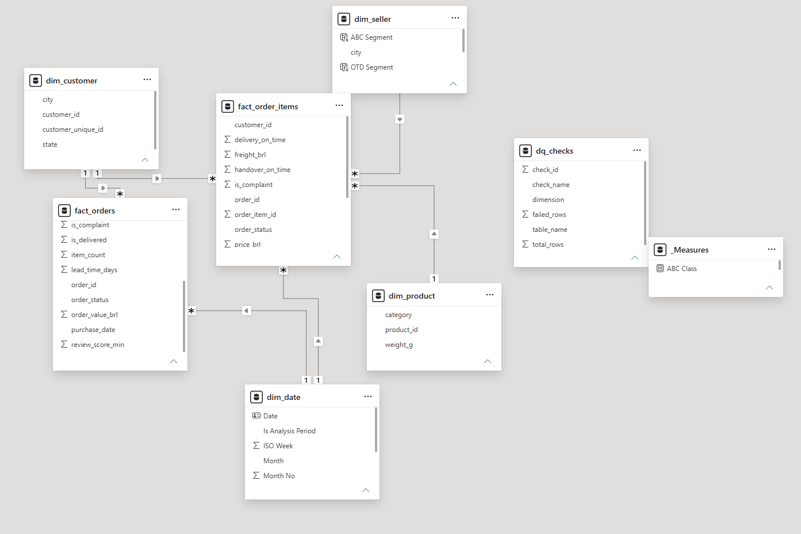
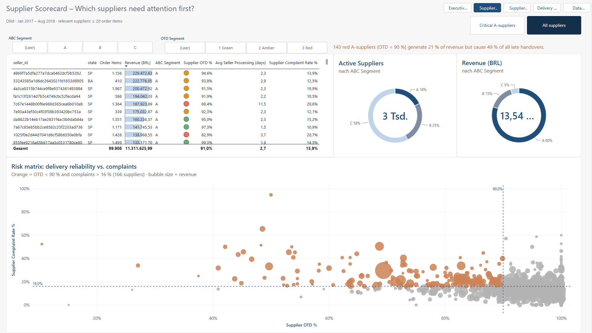
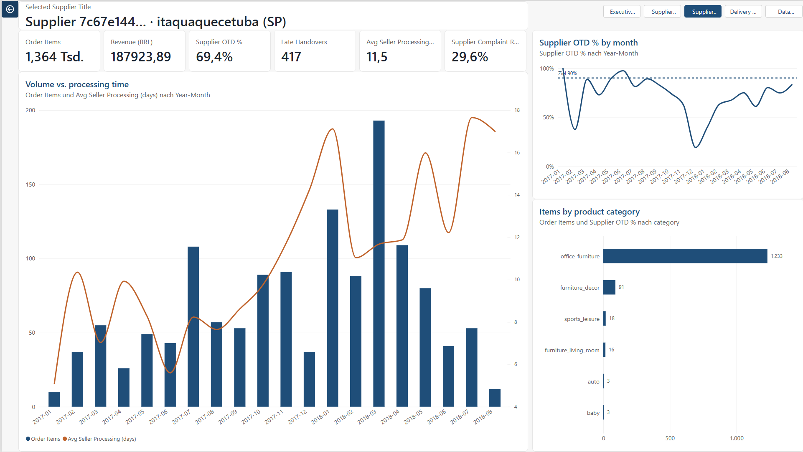
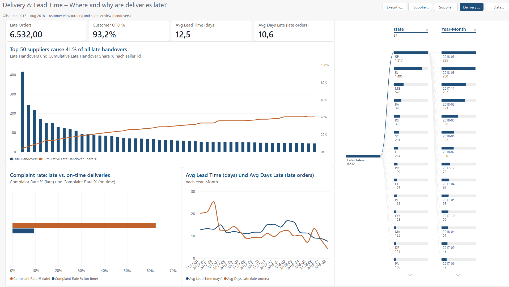
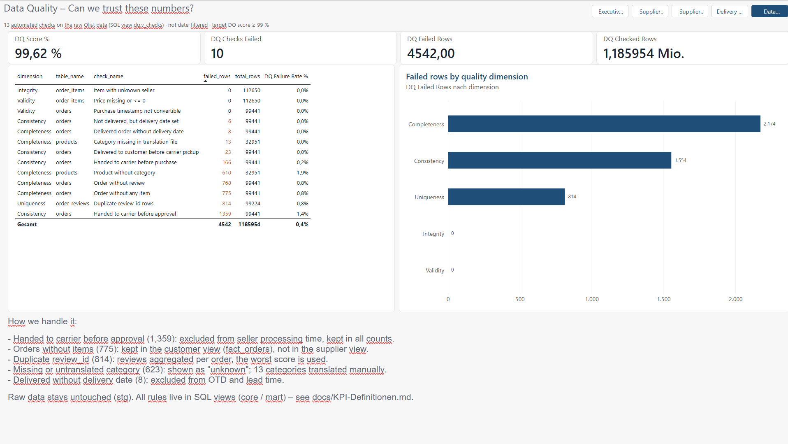

# Supplier & Delivery Performance Dashboard (SQL Server + Power BI)

**English** · [Deutsch](README.de.md) 

> Which suppliers deliver late, cause quality complaints – and where should purchasing act first?



## Business problem
Purchasing and quality teams need one trusted view of supplier performance. In practice, data sits in several systems, KPIs are defined differently per team, and nobody knows how reliable the numbers are. This project builds the full chain – raw data → clean model → KPI scorecard → root-cause drill-down – and makes data quality visible on its own report page.

## Key insights (analysis period Jan 2017 – Aug 2018)
1. **Late delivery drives complaints:** 62.5 % of late orders get a 1–2 star review vs. 9.3 % of on-time orders (**6.7×**).
2. **Problems are concentrated:** the top 10 % of suppliers cause **78.4 %** of all late handovers. 143 red A-suppliers (OTD < 90 %) generate 21 % of revenue but cause **49 %** of late handovers.
3. **Root cause is capacity, not chance:** the worst large supplier (rank 5 by revenue, office furniture) tripled its volume after Black Friday 2017; its processing time rose from 5.6 to 17.1 days and its on-time rate fell to 19 % in Dec 2017.
4. **ABC:** 18 % of suppliers (A class) generate 80 % of revenue.

**Recommendation:** focus supplier development on the short list of red A-suppliers instead of all 3,000, and agree capacity plans with them before peak periods.

## Data
- **Source:** [Brazilian E-Commerce Public Dataset by Olist](https://www.kaggle.com/datasets/olistbr/brazilian-ecommerce) (Kaggle, CC BY-NC-SA 4.0) – 99,441 orders, 112,650 order items, 3,095 sellers, 8 tables
- **Interpretation:** sellers = suppliers · handover to carrier before the shipping limit = supplier on-time delivery · 1–2 star review = complaint proxy
- **Data quality:** 13 automated checks, **DQ score 99.62 %**; every finding has a documented handling rule (see page 4)

## Architecture
```
CSV (8 files) ──Python──► stg (raw, text) ──views──► core (typed, cleaned) ──views──► mart (star schema) ──► Power BI
                                                                     └──► dq.v_checks (13 checks) ─────────┘
```
- **Two fact tables on two grains:** `fact_orders` (customer view, keeps 775 orders without items – otherwise the cancellation rate would be wrong) and `fact_order_items` (supplier view)
- Raw data is never changed; all rules live in SQL views and are versioned in Git



## Report
| Page | Question | Highlights |
|---|---|---|
| Executive Overview | How are we doing? | KPI cards, OTD trend vs. 92 % target, revenue trend, worst states |
| Supplier Scorecard | Which suppliers need attention first? | ABC + traffic lights, risk matrix, one-click bookmark "critical A-suppliers" |
| Supplier Detail (drill-through) | Why is this supplier late? | volume vs. processing time, monthly OTD, product mix |
| Delivery & Lead Time | Where and why are deliveries late? | Pareto, decomposition tree, complaint rate late vs. on time |
| Data Quality | Can we trust these numbers? | DQ score, 13 checks by dimension, handling rules |

| Supplier Scorecard | Supplier Detail |
|---|---|
|  |  |
| **Delivery & Lead Time** | **Data Quality** |
|  |  |

## Quality & governance
- **Tested numbers:** `sql/05_validate.sql` (15 PASS/FAIL tests) and `powerbi/validate_measures.dax` compare every KPI with [docs/expected-results.md](docs/expected-results.md). The tests found two real DAX bugs (`BLANK() = 0` is TRUE; `DIVIDE(BLANK, n)` hid 117 suppliers with 0 % OTD) – both fixed.
- **Row-level security:** role `Region SP` (`dim_customer[state] = "SP"`), tested with "View as" → [screenshot](images/06_rls_view_as_sp.png)
- **Performance:** all visuals < 350 ms in Performance Analyzer (star schema, import mode) → [screenshot](images/07_performance_analyzer.png)
- **Documented KPIs:** [docs/KPI-Definitionen.md](docs/KPI-Definitionen.md) · 36 measures in display folders, descriptions on key measures

## How to run
1. Install SQL Server Express, SSMS, ODBC Driver 18 for SQL Server, Power BI Desktop
2. Run `sql/01_create_database.sql` in SSMS
3. `pip install -r requirements.txt` → `python python\load_olist_to_sqlserver.py --csv-dir C:\data\olist`
4. Run `sql/02_profiling.sql`, `sql/03_core_views.sql`, `sql/04_mart_star_schema.sql`
5. Run `sql/05_validate.sql` – all 15 rows must show **PASS**
6. Open `powerbi/supplier_performance.pbix` (source `localhost\SQLEXPRESS`, database `olist`) → Refresh
   *Rebuild from scratch:* create `dim_date`, relationships and the 3 calculated columns from `powerbi/measures.dax`, paste `powerbi/measures.tmdl` into TMDL view, run `powerbi/validate_measures.dax`
7. PDF version of the report: `powerbi/supplier_performance.pdf`

## Project structure
```
sql/        01 database · 02 profiling · 03 core views · 04 star schema + DQ checks · 05 validation
python/     CSV loader
powerbi/    .pbix, .pdf, measures.dax (readable), measures.tmdl (bulk import), validate_measures.dax, theme
docs/       KPI definitions, expected results, report design, data model (dbml)
images/     screenshots
```

## Link to my experience
During 2.5 years in a customer project at BMW AG (incl. the department "Data Analysis, Supplier Audit") I analysed quality and supplier data from SAP and other source systems, defined KPIs with business units, checked data quality and improved processes with Six Sigma DMAIC. This project applies exactly that approach – measure, understand the root cause, derive an action – to a public dataset and a modern BI stack.

## Tools
SQL Server (T-SQL, views, star schema) · Python (pandas, SQLAlchemy) · Power BI (DAX, TMDL, drill-through, bookmarks, RLS, Performance Analyzer)

## What I would do next
- Move the pipeline to a lakehouse with daily refresh and EUR conversion → project 2
- Let an AI agent write the weekly management summary from these KPIs → project 4

---
*Author: Mahsa Ahmadi · Public data only; no company-internal data was used.*
